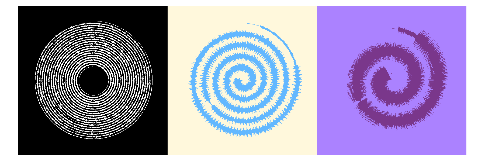

<!-- README.md is generated from README.Rmd. Please edit that file -->

# spirals

This code is designed for artistic/aesthetic visualistion of numbers and
should not be used for serious data visualisation for two reasons

1.  The data may not be fully or correctly reproduced on the spiral
2.  Polar coordinates have major perceptual problems

Read an mp3 file, select just one channel (left) and reduce the number
of data points by aggregating every \~30 points

``` r
library(spirals)
t <- tuneR::readMP3('tests/deadbeat.mp3')
gm <- function(x, n) tapply(x, rep(seq_along(x), each = n, length.out=length(x)), mean)

t_reduced <- gm(t@left, 30)
```

Visualise mp3 on spiral

``` r
patchwork::wrap_plots(
  spiral(t_reduced, n=20, r=30, bg_fill = "black", line_col="white"),
  spiral(t_reduced, n=5, r=0, bg_fill = "cornsilk1", line_col="steelblue1"),
  spiral(t_reduced, n=2, r=0, bg_fill = "mediumpurple1", line_col = "mediumorchid4"))
```

<!-- -->
